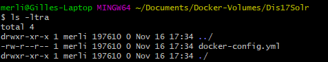
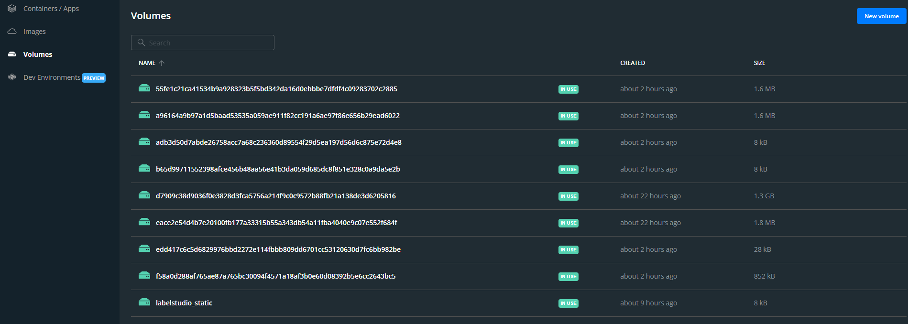
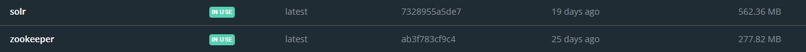
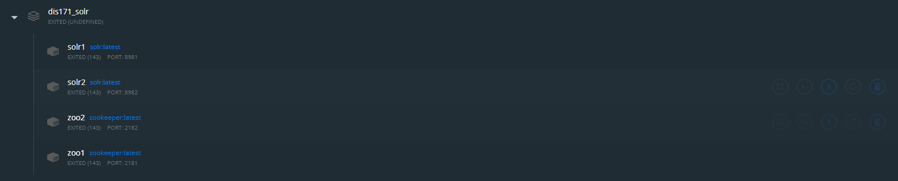

# Tutorial - Docker & Solr

`This is a tutorial written by Gilles Romer and not an official part of the course material.`

The following tutorial will describe how to install Solr and Zookeeper in a Docker environment on Linux, MacOS or Windows.  
View [Discussion - Using Solr with Docker](https://github.com/irgroup-classrooms/dis17-2021/discussions/19) for reference on advantages etc.

## 1.	Firstly, you will have to download and install Docker. 
Therefore, you can use the following Link:  
[Docker download](https://www.docker.com/get-started)  
Once downloaded you should follow the [recommended installation and setup steps](https://docs.docker.com/get-docker/) for your operating system. Keep in mind that you will have to Install WSL as well if you’re not installing docker on a Linux system.  
Docker has some system requirements. If your system does not meet the requirements you might want to choose to run docker on a virtual environment by using software like [VirtualBox](https://www.virtualbox.org/) together with a linux based operating system like [Ubuntu](https://ubuntu.com/#download).
If you also need help on that just ping me and ill either add a tutorial on how to deploy a virtual machine or just explain it to you in person.

## 2.	Once Docker is installed and set up 
you should be able to check its version in any CLI (like CMD or the GIT Bash) with the following command:  
`$ docker --version`  
Its output should look something like this:  
`Docker version 20.10.8, build 3967b7d`

## 3.	Docker will install a tool named [Docker-Compose](https://docs.docker.com/compose/).  
> Compose is a tool for defining and running multi-container Docker applications. With Compose, you use a YAML file to configure your application’s services. Then, with a single command, you create and start all the services from your configuration.  

Fortunately, most of the people creating docker images also provide templates and documentation on how to create such a docker-compose file.  
In addition to the [original solr docker-compose file](https://github.com/docker-solr/docker-solr-examples/blob/master/docker-compose/docker-compose.yml), I have modified it to match the requirements of the solr tutorial.  
Please download my modified [docker-compose.yml](docker-compose.yml) file and save it in a folder. This folder will also later be used as a transfer folder between your local computer and the docker container so choose a name and place you will remember.  

## 4.	Once the docker-compose file is Downloaded 
you will want to open a CLI and navigate to the folder that you have created in point 3 in which you should have placed the docker-compose.yml.  
In case you’re not familiar on how to navigate into directories with a CLI [this tutorial](https://www.ibm.com/docs/en/aix/7.2?topic=directories-changing-another-directory-cd-command) will get you started.  
To verify that you are in the right directory/folder you can run the following command:  
`$ dir` - on windows CMD  
`$ ls -ltra` - on the GIT Bash or most of linux systems  
The output should look like this:  
  

## 5.	Now we can finally compose our docker environment. 
To do so run the following command:  
`$ docker-compose up --no-start`  
This process will download the images and configure the containers as defined in the docker-compose file.  
Once done you should see that there has been changes to your docker desktop application:  
1. There are a few new volumes in the volumes tab. You can consider those as the storage medium for your individual containers.  
Output looks something like this:  
  
2. You should see two new images that have been downloaded. Both images have the latest tag and should be marked as in use.  
Output should look like this:  
  
3.	The most important part is the containers/apps tab. You should find your docker container here. Its name will depend on how you named the folder in point 3. Once you expand the App you should see two solr and two zookeeper containers.  
Output should look something like this:  

## 6.	If everything looks the same as on the screenshots
you’re ready to launch your containers. To do so click the play button on the APP you expanded before. **Do not start the containers individually** as the two solr containers depend on the two zookeeper containers to have started first. Docker will take care of this as long as you start and stop your application with the play and stop button on the app category.  

___
If you made it successfully to this point your system should be up and running. **The nodes mentioned in the solr tutorial/exercises are your containers**. You will therefore not have to start any nodes. You will also **not be able to start the interactive session that is also mentioned in the solr tutorial/exercise** as the nodes are already running.  
Per default (configured in the docker-compose.yml) your two nodes are running on **port 8982 and 8981**.  
If you want to run commands on your solr container you can either use the [CLI button](Docker_Container_CLI.png) on your specific container or use another CLI.  
To use your own CLI to connect to the container run the following command:  
`$ docker exec -it solr1 /bin/bash`  
**Important:** Once you first launch the Docker containers a `data` folder will be created in the same folder where you've created the docker-compose.yml before.  
This folder is your transfer folder between your local machine and the containers. You will have to paste any files that you want to access within the container here.  
On the container itself (Connected via CLI) you will find the same folder under `/tmp/data`
